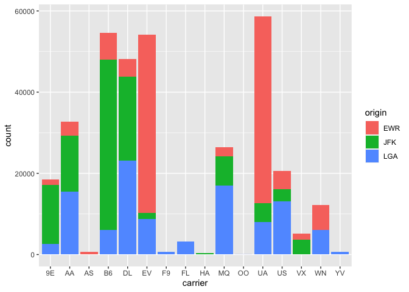

Untitled
================

## GitHub Documents

This is an R Markdown format used for publishing markdown documents to
GitHub. When you click the **Knit** button all R code chunks are run and
a markdown file (.md) suitable for publishing to GitHub is generated.

## Including Code

``` r
joined_flights <- flights %>% 
  inner_join(airlines, by = "carrier") %>% 
  filter(origin=="EWR",dest=="LAS", hour=="10", month=="3")
```

## Including Plots

You can also embed plots, for example:

``` r
ggplot(data = flights, mapping = aes(x = carrier, fill = origin)) +
  geom_bar()
```

<!-- -->

Note that the `echo = FALSE` parameter was added to the code chunk to
prevent printing of the R code that generated the plot.
